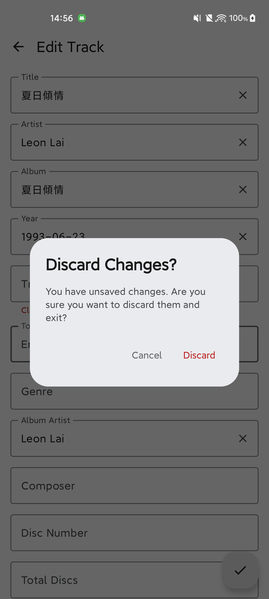

# Mastigias

<p align="center">
  
</p>

Mastigias is a high-performance, native Android music tag editor built with Modern Android Architecture (MAD), Jetpack Compose, Material 3 Expressive, and TagLib C++ via JNI.

## Screenshots

| Library Screen | Tag Editor |
|:---:|:---:|
|  |  |

## Features

- **High-Performance Native Engine**: C++ TagLib 1.13.1 integrated via JNI supporting MP3, FLAC, M4A/MP4, OGG/Opus/Vorbis, WAV, AIFF, and WMA.
- **8-Step Scoped Storage Safe Write Protocol**: Staged temporary work files and atomic updates to guarantee audio file integrity and avoid corruption.
- **Modern Jetpack Compose UI**: Clean flat and album accordion views, expressive Material 3 styling, and full dark/light theme support.
- **Batch & Single File Editing**: Edit individual tracks or batch-edit common metadata across entire albums simultaneously.
- **Embedded Artwork**: Embed and replace album art with two-pass bounds decoding and downsampling via Coil 3.
- **Lyrics Integration**: Multiline lyrics editor with external SongSync integration support.
- **In-App Diagnostics**: Fast, in-memory circular log viewer for monitoring media scanning and storage operations.

## Architecture

- **Domain Layer**: Pure Kotlin business logic without Android framework dependencies.
- **Data Layer**: Room SQLite cache with FTS4 full-text search, MediaStore data source, DataStore preferences, and TagLib JNI bridge.
- **UI Layer**: Jetpack Compose, Navigation Compose with type-safe routes, and Hilt dependency injection.

## Building

```bash
# Clone repository
git clone https://github.com/nichbar/Mastigias.git
cd Mastigias

# Compile Kotlin & run unit tests
./gradlew test compileDebugKotlin

# Build Debug APK
./gradlew assembleDebug

# Build Release APK
./gradlew assembleRelease
```

## License

Mastigias is licensed under the **GNU Affero General Public License v3.0 only** (`AGPL-3.0-only`). See the [LICENSE](LICENSE) file for the full license text.
