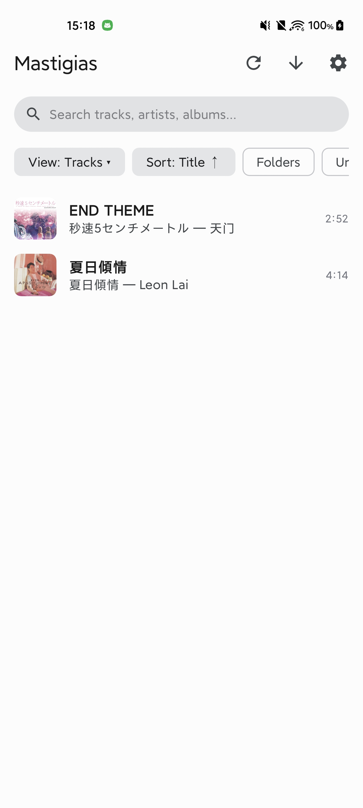
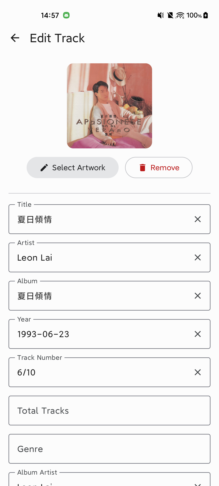

<p align="center">
  <picture>
    <source media="(prefers-color-scheme: dark)" srcset="art/mastigias_dark.svg">
    
  </picture>
</p>

<h1 align="center">Mastigias</h1>

<p align="center">
  A simple native Android music tag editor built with TagLib C++ via JNI.
</p>

Some tracks on my Android device used the `album-artist` field instead of `artist`, which prevented my music player from recognizing the actual artist. I asked an LLM to recommend an open-source Android app that could edit track metadata; however, some apps could only edit one track at a time (and I had an entire album to edit), while others simply failed to load the track list. Consequently, I decided to write a simple music tag editor that just works and supports batch editing.

<p align="center">
  <a href="https://github.com/nichbar/Mastigias/releases/latest"></a>
  <a href="LICENSE"></a>
</p>

## Screenshots

| Library | Tag Editor |
|:---:|:---:|
|  |  |

## Features

- **High-Performance Native Engine**: C++ TagLib 1.13.1 integrated via JNI supporting MP3, FLAC, M4A/MP4, OGG/Opus/Vorbis, WAV, AIFF, and WMA.
- **Batch & Single File Editing**: Edit individual tracks or batch-edit common metadata across entire albums simultaneously.
- **Embedded Artwork**: Embed and replace album art with two-pass bounds decoding and downsampling via Coil 3.
- **Lyrics Integration**: Multiline lyrics editor with external SongSync integration support.

## Download

Download the latest APK from [GitHub Releases](https://github.com/nichbar/Mastigias/releases/latest):

- **`Mastigias.<tag>.apk`** (`arm64-v8a`): Recommended for most modern Android devices (smaller file size).
- **`Mastigias.<tag>-universal.apk`** (Universal): Includes native libraries for all architectures (`arm64-v8a`, `armeabi-v7a`, `x86`, `x86_64`) for maximum compatibility.

## Architecture

- **Domain Layer**: Pure Kotlin business logic without Android framework dependencies.
- **Data Layer**: Room SQLite cache with FTS4 full-text search, MediaStore data source, DataStore preferences, and TagLib JNI bridge.
- **UI Layer**: Jetpack Compose, Navigation Compose with type-safe routes, and Hilt dependency injection.

## Building

```bash
# Clone repository
git clone https://github.com/nichbar/Mastigias.git
cd Mastigias

# Compile Kotlin & run unit tests
./gradlew test compileDebugKotlin

# Build Debug APK
./gradlew assembleDebug

# Build Release APK
./gradlew assembleRelease
```

## License

Mastigias is licensed under the **GNU Affero General Public License v3.0 only** (`AGPL-3.0-only`). See the [LICENSE](LICENSE) file for the full license text.
